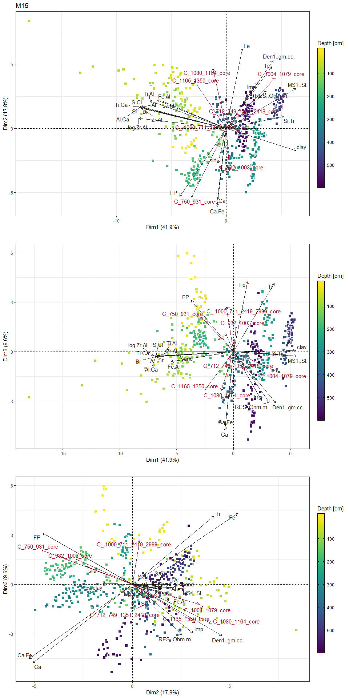

PCA analysis
============

Load dependencies
-----------------

``` r
#load handling
library(tidyverse)
theme_set(theme_bw())
# easy plotting of pca results
library(factoextra)
library(gridExtra)
library(psych)
# color
library(RColorBrewer)
library(viridis)
```

Define a plot function
----------------------

``` r
plot_pca = function(pca,axes,title){
        col_codes = rep("Phys. prop",ncol(pca$x))
        col_codes[grepl("C_.*_core",names(pca$center))] = "CT comp."
        fviz_pca_biplot(pca, axes = axes,
                        geom.ind = "point",
                        habillage = rep("a",nrow(dat)),
                        fill.ind = dat$Depth..mm./10,
                        col.var = grepl("C_.*_core",names(dat[,-1])),
                        repel = TRUE,
                        pointsize = 2.5)+
                scale_shape_manual(breaks = "obs",values = 22, guide = FALSE)+
                scale_color_manual(breaks = c("a","CT comp.","Phys. prop"),
                                   values = c("white","#252525","#a50026"),
                                   guide = FALSE)+
                scale_fill_viridis(trans = "reverse",
                                   breaks = seq(from = round(min(dat$Depth..mm./10),-2),
                                                to = round(max(dat$Depth..mm./10),-2),
                                                by = 100),
                                   guide = guide_colorbar(title = "Depth [cm]",
                                                          title.position = "top",
                                                          direction = "vertical",
                                                          barwidth = 1, barheight = 20,
                                                          ticks.colour="black",frame.colour = "black"))+
                ggtitle(title)+
                theme_bw()
        
}
```

Loop over every core, plot variable histograms, calculate correlations and perform PCA.
---------------------------------------------------------------------------------------

``` r
for(core_name in c("GC01","K3","M08","M15","PC06")){
        print(paste("Core:",core_name))
        dat = read.csv(paste("properties_data/",core_name,".csv", sep = ""))
        python = read.csv(paste("../script_ouput/data_tables/", core_name ,".csv", sep = ""))
        
        for(c in names(python)[grepl("C_.*_core",names(python))]){
                interp = as.data.frame(approx(x = python$Depth_mm, y = python[,c],xout = dat$Depth..mm.)$y)
                colnames(interp) = c
                dat = cbind(dat, interp)
        }
        dat = na.omit(dat)
        row.names(dat) = dat$Depth..mm.
        
        # Check for lognormal distributions and outliers
        par(mfrow = c(8,4))
        for (col in 2:ncol(dat)){
                hist(dat[,col], breaks = 20, main = names(dat)[col])
        }
        #calculate and export correlations
        corr = corr.test(dat[,-1],
                         use = "pairwise",
                         method="pearson",
                         adjust="none",
                         alpha=.05,ci=TRUE)
        # export correlation table and p values
        write.csv(corr$r,paste(core_name,"_cor_table.csv",sep = ""))
        write.csv(corr$p,paste(core_name,"_p_value_table.csv",sep = ""))
        # perform pca
        pca = prcomp(dat[,-(1)], center = T, scale = T)
        # plot and save scree plot
        # pdf(paste(core_name, "scree.pdf",sep = "_"), width = 10, height = 8)
        # postscript(paste(core_name, "scree.eps",sep = "_"), paper="special",width = 10, height = 8)
        screeplot(pca, type = "lines")
        par(mfrow = c(1,1))
        # dev.off()
        # plot and save biplots
        # pdf(paste(core_name, "biplot.pdf",sep = "_"), width = 10, height = 20)
        # postscript(paste(core_name, "biplot.eps",sep = "_"),paper="special",horizontal=FALSE,width=10,height=20)
        g12_kmeans_pca_random = plot_pca(pca,axes = c(1,2), title = core_name)
        g13_kmeans_pca_random = plot_pca(pca, axes = c(1,3), title = "")
        g23_kmeans_pca_random = plot_pca(pca, axes = c(2,3), title = "")
        grid.arrange(g12_kmeans_pca_random,g13_kmeans_pca_random, g23_kmeans_pca_random)
        # dev.off()
}        
```

    ## [1] "Core: GC01"


    ## [1] "Core: K3"


    ## [1] "Core: M08"


    ## [1] "Core: M15"



    ## [1] "Core: PC06"


